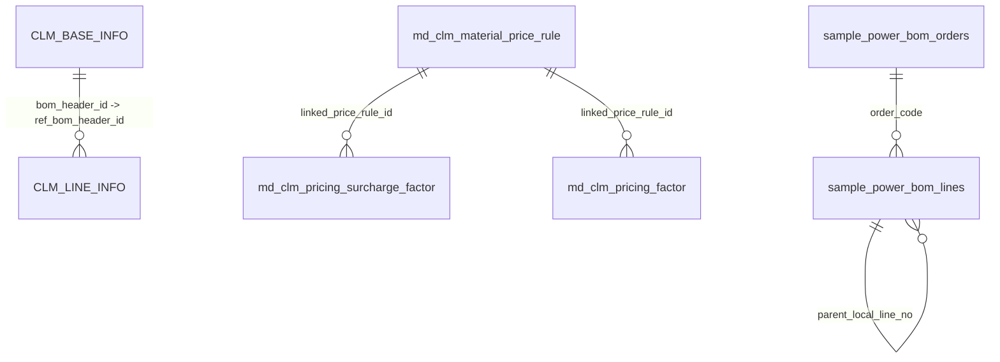

# 亿纬锂能 CPQ SQLite 数据库 Schema 说明

- 数据库文件：`亿纬锂能_da.sqlite`
- 生成文件：`数据库Schema说明.md`
- 说明范围：当前 SQLite 中已经存在的物理表、导入元数据表，以及 DA 中已定义但尚未物理建表的实体。

## 1. 表清单

| 表名 | 行数 | 类型 | 作用 |
|---|---:|---|---|
| `CLM_BASE_INFO` | 18 | 配置 BOM | 配置 BOM 头表，保存产品级 BOM 主记录。 |
| `CLM_LINE_INFO` | 61 | 配置 BOM | 配置 BOM 行表，保存 BOM 组件明细，并通过 ref_bom_header_id 关联 BOM 头。 |
| `config_assistant_fields` | 32 | DA 元数据 | 配置助手字段清单视图表。 |
| `config_rule_insert_import_metadata` | 2 | 导入元数据 | 从 配置规则insert.txt 导入规则 SQL 的记录。 |
| `da_entity_catalog` | 21 | DA 元数据 | DA 逻辑实体目录，按助手、业务对象、逻辑实体、物理表聚合字段数量。 |
| `da_fields` | 343 | DA 元数据 | DA 全量字段目录，保存报价、配置、规则三个助手的字段梳理结果。 |
| `da_metadata` | 1 | DA 元数据 | DA 梳理工作簿导入元数据。 |
| `md_clm_distribution_rule` | 3 | 规则/定价 | 产品配单/配置规则表，保存配置约束与自动匹配规则。 |
| `md_clm_material_price_rule` | 9 | 规则/定价 | 产品定价/报价规则主表，保存规则名称、分类、表达式、生效状态等。 |
| `md_clm_pricing_factor` | 13 | 规则/定价 | 定价因子基础表，保存技术溢价、市场调节等定价因子数据。 |
| `md_clm_pricing_surcharge_factor` | 18 | 规则/定价 | 加价因子明细表，保存加价项、触发因子、因子取值、加价金额与单位。 |
| `quote_assistant_fields` | 211 | DA 元数据 | 报价助手字段清单视图表。 |
| `quote_bom_direct_import_metadata` | 2 | 导入元数据 | 从 quote_bom.db 直接导入 BOM 头/行的记录。 |
| `quote_bom_rule_import_metadata` | 3 | 导入元数据 | 从 quote_bom.db 导入规则、加价因子、定价因子的记录。 |
| `rule_assistant_fields` | 100 | DA 元数据 | 规则助手字段清单视图表。 |
| `sample_power_bom_import_metadata` | 1 | 样例 BOM | 样例 BOM 导入批次元数据。 |
| `sample_power_bom_lines` | 1070 | 样例 BOM | 20 份动力电池样例 BOM 的层级明细表，支持同订单内父子行关系。 |
| `sample_power_bom_orders` | 20 | 样例 BOM | 20 份动力电池样例 BOM 的订单/配置头表。 |

## 2. ER 关系

补充说明：`md_clm_distribution_rule` 是配置/配单规则表，目前没有声明外键；它通过规则表达式中的配置特征与 BOM/报价流程发生业务关联。`da_fields`、`da_entity_catalog` 等 DA 表是字段目录，不直接参与业务主外键。

## 3. 物理表字段说明

### 3.1 `CLM_BASE_INFO`

配置 BOM 头表，保存产品级 BOM 主记录。 当前行数：18。

| 字段 | 类型 | 主键 | 可空 | 作用 |
|---|---|---|---|---|
| `bom_header_id` | INTEGER | PK | 是 | bom清单头ID；BOM 头 ID，配置 BOM 主键。 |
| `bom_name` | TEXT |  | 是 | 物料清单名称；BOM 清单名称。 |
| `product_item_id` | TEXT |  | 是 | 产品编码ID；产品物料 ID。 |
| `product_item_code` | TEXT |  | 是 | 产品编码；产品物料编码。 |
| `product_item_name` | TEXT |  | 是 | 产品名称；产品物料名称。 |
| `product_item_spec` | TEXT |  | 是 | 规格型号 |
| `basis_quantity` | REAL |  | 是 | 基准数量 |
| `bom_version` | TEXT |  | 是 | BOM版本；BOM 版本。 |
| `delete_flag` | TEXT |  | 是 | 删除标识 |
| `creation_date` | TEXT |  | 是 | 创建日期 |
| `created_by` | TEXT |  | 是 | 创建人 |
| `last_update_date` | TEXT |  | 是 | 最后修改日期 |
| `last_updated_by` | TEXT |  | 是 | 最后修改人 |

### 3.2 `CLM_LINE_INFO`

配置 BOM 行表，保存 BOM 组件明细，并通过 ref_bom_header_id 关联 BOM 头。 当前行数：61。

外键关系：`ref_bom_header_id` -> `CLM_BASE_INFO(bom_header_id)`。

| 字段 | 类型 | 主键 | 可空 | 作用 |
|---|---|---|---|---|
| `bom_line_id` | INTEGER | PK | 是 | 物料清单行ID；BOM 行 ID，配置 BOM 行主键。 |
| `seq_num` | TEXT |  | 是 | 序号 |
| `component_item_id` | TEXT |  | 是 | 组件ID；组件物料 ID。 |
| `component_item_code` | TEXT |  | 是 | 组件编码；组件物料编码。 |
| `component_item_name` | TEXT |  | 是 | 组件名称；组件物料名称。 |
| `component_item_spec` | TEXT |  | 是 | 组件规格型号 |
| `component_item_quantity` | REAL |  | 是 | 物料清单组件数量；组件用量。 |
| `component_item_uom_code` | TEXT |  | 是 | 物料用量单位编码；组件用量单位编码。 |
| `effective_date` | TEXT |  | 是 | 生效日期 |
| `disable_date` | TEXT |  | 是 | 失效日期 |
| `ref_bom_header_id` | INTEGER |  | 是 | 物料清单头ID；关联 BOM 头 ID，指向 CLM_BASE_INFO.bom_header_id。 |
| `creation_date` | TEXT |  | 是 | 创建日期 |
| `created_by` | TEXT |  | 是 | 创建人 |
| `last_update_date` | TEXT |  | 是 | 最后修改日期 |
| `last_updated_by` | TEXT |  | 是 | 最后修改人 |

### 3.3 `config_assistant_fields`

配置助手字段清单视图表。 当前行数：32。

| 字段 | 类型 | 主键 | 可空 | 作用 |
|---|---|---|---|---|
| `source_row` | INTEGER |  | 是 | 来源 Excel/文本中的原始行号。 |
| `business_object` | TEXT |  | 是 | 业务对象名称，例如配置 BOM、规则配置、报价单。 |
| `logic_entity` | TEXT |  | 是 | 逻辑实体名称。 |
| `physical_table` | TEXT |  | 是 | 逻辑实体对应的物理表名。 |
| `attribute_name` | TEXT |  | 是 | 字段中文业务名称。 |
| `field_code` | TEXT |  | 是 | 字段英文编码。 |
| `is_primary_key` | INTEGER |  | 是 | 是否主键，1 表示是。 |
| `foreign_key` | TEXT |  | 是 | DA 中记录的外键说明。 |

### 3.4 `config_rule_insert_import_metadata`

从 配置规则insert.txt 导入规则 SQL 的记录。 当前行数：2。

| 字段 | 类型 | 主键 | 可空 | 作用 |
|---|---|---|---|---|
| `source_file` | TEXT | PK | 否 | 来源文件路径。 |
| `imported_table` | TEXT | PK | 否 | 本次导入写入的目标表名。 |
| `imported_count` | INTEGER |  | 否 | 本次导入写入的记录数。 |
| `imported_at` | TEXT |  | 否 | 导入时间。 |

### 3.5 `da_entity_catalog`

DA 逻辑实体目录，按助手、业务对象、逻辑实体、物理表聚合字段数量。 当前行数：21。

| 字段 | 类型 | 主键 | 可空 | 作用 |
|---|---|---|---|---|
| `id` | INTEGER |  | 是 | 通用自增或源数据 ID。 |
| `assistant` | TEXT |  | 是 | 助手域标识：quote、config、rule。 |
| `business_object` | TEXT |  | 是 | 业务对象名称，例如配置 BOM、规则配置、报价单。 |
| `logic_entity` | TEXT |  | 是 | 逻辑实体名称。 |
| `physical_table` | TEXT |  | 是 | 逻辑实体对应的物理表名。 |
| `field_count` | INTEGER |  | 是 | 字段数量。 |
| `primary_key_count` | INTEGER |  | 是 | 主键字段数量。 |
| `foreign_key_count` | INTEGER |  | 是 | 外键字段数量。 |

### 3.6 `da_fields`

DA 全量字段目录，保存报价、配置、规则三个助手的字段梳理结果。 当前行数：343。

| 字段 | 类型 | 主键 | 可空 | 作用 |
|---|---|---|---|---|
| `id` | INTEGER |  | 是 | 通用自增或源数据 ID。 |
| `assistant` | TEXT |  | 是 | 助手域标识：quote、config、rule。 |
| `source_sheet` | TEXT |  | 是 | 来源工作表名称。 |
| `source_row` | INTEGER |  | 是 | 来源 Excel/文本中的原始行号。 |
| `business_object` | TEXT |  | 是 | 业务对象名称，例如配置 BOM、规则配置、报价单。 |
| `logic_entity` | TEXT |  | 是 | 逻辑实体名称。 |
| `physical_table` | TEXT |  | 是 | 逻辑实体对应的物理表名。 |
| `attribute_name` | TEXT |  | 是 | 字段中文业务名称。 |
| `field_type` | TEXT |  | 是 | DA 中记录的字段类型。 |
| `field_code` | TEXT |  | 是 | 字段英文编码。 |
| `is_primary_key` | INTEGER |  | 是 | 是否主键，1 表示是。 |
| `foreign_key` | TEXT |  | 是 | DA 中记录的外键说明。 |

### 3.7 `da_metadata`

DA 梳理工作簿导入元数据。 当前行数：1。

| 字段 | 类型 | 主键 | 可空 | 作用 |
|---|---|---|---|---|
| `source_file` | TEXT |  | 是 | 来源文件路径。 |
| `output_file` | TEXT |  | 是 | 业务扩展字段或导入保留字段。 |
| `sheet_count` | INTEGER |  | 是 | 来源工作簿的工作表数量。 |
| `field_count` | INTEGER |  | 是 | 字段数量。 |
| `entity_count` | INTEGER |  | 是 | 逻辑实体数量。 |

### 3.8 `md_clm_distribution_rule`

产品配单/配置规则表，保存配置约束与自动匹配规则。 当前行数：3。

| 字段 | 类型 | 主键 | 可空 | 作用 |
|---|---|---|---|---|
| `md_clm_distribution_rule_id` | INTEGER | PK | 是 | 主键ID |
| `rule_name` | TEXT |  | 是 | 规则名称 |
| `rule_desc` | TEXT |  | 是 | 规则描述 |
| `rule_expression_view` | TEXT |  | 是 | 规则表达式（页面显示）；页面展示用规则表达式。 |
| `rule_expression` | TEXT |  | 是 | 规则表达式 |
| `updated_by` | TEXT |  | 是 | 更新者；更新人。 |
| `updated_at` | TEXT |  | 是 | 更新时间 |
| `effective_status` | INTEGER |  | 是 | 是否生效 |
| `created_by` | TEXT |  | 是 | 创建者；创建人。 |
| `created_at` | TEXT |  | 是 | 创建时间 |
| `is_deleted` | INTEGER |  | 是 | 是否删除；逻辑删除标识。 |
| `deleted_by` | TEXT |  | 是 | 删除者；删除人。 |
| `deleted_at` | TEXT |  | 是 | 删除时间 |
| `effective_start_time` | TEXT |  | 是 | 生效开始时间 |
| `effective_end_time` | TEXT |  | 是 | 生效结束时间 |
| `corp_id` | TEXT |  | 是 | 企业ID；企业 ID。 |
| `system_version` | TEXT |  | 是 | 系统版本号 |
| `owner_org_code` | TEXT |  | 是 | 数据所属组织 |

### 3.9 `md_clm_material_price_rule`

产品定价/报价规则主表，保存规则名称、分类、表达式、生效状态等。 当前行数：9。

| 字段 | 类型 | 主键 | 可空 | 作用 |
|---|---|---|---|---|
| `md_clm_material_price_rule_id` | INTEGER | PK | 是 | 主键ID |
| `rule_code` | TEXT |  | 是 | 规则编码。 |
| `rule_name` | TEXT |  | 是 | 规则名称 |
| `rule_classification` | TEXT |  | 是 | 规则分类 |
| `rule_desc` | TEXT |  | 是 | 规则描述 |
| `rule_expression` | TEXT |  | 是 | 规则表达式 |
| `rule_expression_view` | TEXT |  | 是 | 规则表达式（页面显示）；页面展示用规则表达式。 |
| `business_class` | TEXT |  | 是 | 业务分类。 |
| `apply_scope` | TEXT |  | 是 | 规则或因子的应用范围。 |
| `expression_mode` | TEXT |  | 是 | 表达式模式，例如拖拽模式、专家模式。 |
| `source_status` | TEXT |  | 是 | 来源系统中的原始状态。 |
| `updated_by` | TEXT |  | 是 | 更新者；更新人。 |
| `updated_at` | TEXT |  | 是 | 更新时间 |
| `effective_status` | TEXT |  | 是 | 是否生效 |
| `created_by` | TEXT |  | 是 | 创建者；创建人。 |
| `created_at` | TEXT |  | 是 | 创建时间 |
| `is_deleted` | INTEGER |  | 是 | 是否删除；逻辑删除标识。 |
| `deleted_by` | TEXT |  | 是 | 删除者；删除人。 |
| `deleted_at` | TEXT |  | 是 | 删除时间 |
| `effective_start_time` | TEXT |  | 是 | 生效开始时间 |
| `effective_end_time` | TEXT |  | 是 | 生效结束时间 |
| `corp_id` | TEXT |  | 是 | 企业ID；企业 ID。 |
| `system_version` | TEXT |  | 是 | 系统版本号 |
| `owner_org_code` | TEXT |  | 是 | 数据所属组织 |
| `source_table` | TEXT |  | 否 | 来源表名，用于追溯导入来源。 |
| `source_id` | INTEGER |  | 是 | 来源表主键 ID，用于追溯源记录。 |

### 3.10 `md_clm_pricing_factor`

定价因子基础表，保存技术溢价、市场调节等定价因子数据。 当前行数：13。

外键关系：`linked_price_rule_id` -> `md_clm_material_price_rule(md_clm_material_price_rule_id)`。

| 字段 | 类型 | 主键 | 可空 | 作用 |
|---|---|---|---|---|
| `md_clm_pricing_factor_id` | INTEGER | PK | 是 | 业务扩展字段或导入保留字段。 |
| `linked_price_rule_id` | INTEGER |  | 是 | 关联的定价/报价规则主表 ID，可为空。 |
| `apply_scope` | TEXT |  | 是 | 规则或因子的应用范围。 |
| `surcharge_category` | TEXT |  | 是 | 加价或定价因子分类。 |
| `effective_start` | TEXT |  | 是 | 因子生效开始日期。 |
| `is_active` | TEXT |  | 是 | 是否启用。 |
| `surcharge_name` | TEXT |  | 是 | 加价项或定价因子名称。 |
| `surcharge_factor` | TEXT |  | 是 | 触发加价/定价的因子字段。 |
| `factor_value` | TEXT |  | 是 | 因子取值。 |
| `surcharge_amount` | REAL |  | 是 | 加价金额或因子金额。 |
| `surcharge_unit` | TEXT |  | 是 | 金额单位。 |
| `source_table` | TEXT |  | 否 | 来源表名，用于追溯导入来源。 |
| `source_id` | INTEGER |  | 是 | 来源表主键 ID，用于追溯源记录。 |

### 3.11 `md_clm_pricing_surcharge_factor`

加价因子明细表，保存加价项、触发因子、因子取值、加价金额与单位。 当前行数：18。

外键关系：`linked_price_rule_id` -> `md_clm_material_price_rule(md_clm_material_price_rule_id)`。

| 字段 | 类型 | 主键 | 可空 | 作用 |
|---|---|---|---|---|
| `md_clm_pricing_surcharge_factor_id` | INTEGER | PK | 是 | 业务扩展字段或导入保留字段。 |
| `linked_price_rule_id` | INTEGER |  | 是 | 关联的定价/报价规则主表 ID，可为空。 |
| `apply_scope` | TEXT |  | 是 | 规则或因子的应用范围。 |
| `surcharge_category` | TEXT |  | 是 | 加价或定价因子分类。 |
| `effective_start` | TEXT |  | 是 | 因子生效开始日期。 |
| `is_active` | TEXT |  | 是 | 是否启用。 |
| `surcharge_name` | TEXT |  | 是 | 加价项或定价因子名称。 |
| `surcharge_factor` | TEXT |  | 是 | 触发加价/定价的因子字段。 |
| `factor_value` | TEXT |  | 是 | 因子取值。 |
| `surcharge_amount` | REAL |  | 是 | 加价金额或因子金额。 |
| `surcharge_unit` | TEXT |  | 是 | 金额单位。 |
| `extra_unit` | TEXT |  | 是 | 附加单位。 |
| `source_table` | TEXT |  | 否 | 来源表名，用于追溯导入来源。 |
| `source_id` | INTEGER |  | 是 | 来源表主键 ID，用于追溯源记录。 |

### 3.12 `quote_assistant_fields`

报价助手字段清单视图表。 当前行数：211。

| 字段 | 类型 | 主键 | 可空 | 作用 |
|---|---|---|---|---|
| `source_row` | INTEGER |  | 是 | 来源 Excel/文本中的原始行号。 |
| `business_object` | TEXT |  | 是 | 业务对象名称，例如配置 BOM、规则配置、报价单。 |
| `logic_entity` | TEXT |  | 是 | 逻辑实体名称。 |
| `attribute_name` | TEXT |  | 是 | 字段中文业务名称。 |
| `field_type` | TEXT |  | 是 | DA 中记录的字段类型。 |

### 3.13 `quote_bom_direct_import_metadata`

从 quote_bom.db 直接导入 BOM 头/行的记录。 当前行数：2。

| 字段 | 类型 | 主键 | 可空 | 作用 |
|---|---|---|---|---|
| `source_db` | TEXT | PK | 否 | 来源数据库路径。 |
| `imported_table` | TEXT | PK | 否 | 本次导入写入的目标表名。 |
| `imported_count` | INTEGER |  | 否 | 本次导入写入的记录数。 |
| `imported_at` | TEXT |  | 否 | 导入时间。 |

### 3.14 `quote_bom_rule_import_metadata`

从 quote_bom.db 导入规则、加价因子、定价因子的记录。 当前行数：3。

| 字段 | 类型 | 主键 | 可空 | 作用 |
|---|---|---|---|---|
| `source_db` | TEXT | PK | 否 | 来源数据库路径。 |
| `imported_table` | TEXT | PK | 否 | 本次导入写入的目标表名。 |
| `imported_count` | INTEGER |  | 否 | 本次导入写入的记录数。 |
| `imported_at` | TEXT |  | 否 | 导入时间。 |

### 3.15 `rule_assistant_fields`

规则助手字段清单视图表。 当前行数：100。

| 字段 | 类型 | 主键 | 可空 | 作用 |
|---|---|---|---|---|
| `source_row` | INTEGER |  | 是 | 来源 Excel/文本中的原始行号。 |
| `business_object` | TEXT |  | 是 | 业务对象名称，例如配置 BOM、规则配置、报价单。 |
| `logic_entity` | TEXT |  | 是 | 逻辑实体名称。 |
| `physical_table` | TEXT |  | 是 | 逻辑实体对应的物理表名。 |
| `attribute_name` | TEXT |  | 是 | 字段中文业务名称。 |
| `field_code` | TEXT |  | 是 | 字段英文编码。 |
| `is_primary_key` | INTEGER |  | 是 | 是否主键，1 表示是。 |
| `foreign_key` | TEXT |  | 是 | DA 中记录的外键说明。 |

### 3.16 `sample_power_bom_import_metadata`

样例 BOM 导入批次元数据。 当前行数：1。

| 字段 | 类型 | 主键 | 可空 | 作用 |
|---|---|---|---|---|
| `source_file` | TEXT |  | 是 | 来源文件路径。 |
| `order_count` | INTEGER |  | 是 | 导入订单数量。 |
| `line_count` | INTEGER |  | 是 | 导入行数量。 |

### 3.17 `sample_power_bom_lines`

20 份动力电池样例 BOM 的层级明细表，支持同订单内父子行关系。 当前行数：1070。

外键关系：`order_code, parent_local_line_no` -> `sample_power_bom_lines(order_code, local_line_no)`；`order_code` -> `sample_power_bom_orders(order_code)`。

| 字段 | 类型 | 主键 | 可空 | 作用 |
|---|---|---|---|---|
| `order_code` | TEXT | PK | 否 | 样例 BOM 订单编码，也是样例 BOM 头表主键。 |
| `local_line_no` | INTEGER | PK | 否 | 订单内本地行号，与 order_code 组成样例 BOM 行主键。 |
| `parent_local_line_no` | INTEGER |  | 是 | 同一订单内父级行号，用于构成 BOM 层级树。 |
| `source_row` | INTEGER |  | 是 | 来源 Excel/文本中的原始行号。 |
| `level` | INTEGER |  | 否 | BOM 层级。 |
| `level_tag` | TEXT |  | 是 | 原始层级标签。 |
| `item_type` | TEXT |  | 是 | 物料类型或节点类型。 |
| `item_code` | TEXT |  | 是 | 物料编码。 |
| `item_name` | TEXT |  | 是 | 物料名称。 |
| `quantity` | REAL |  | 是 | 数量。 |
| `raw_text` | TEXT |  | 是 | 原始 BOM 行文本。 |

### 3.18 `sample_power_bom_orders`

20 份动力电池样例 BOM 的订单/配置头表。 当前行数：20。

| 字段 | 类型 | 主键 | 可空 | 作用 |
|---|---|---|---|---|
| `order_code` | TEXT | PK | 是 | 样例 BOM 订单编码，也是样例 BOM 头表主键。 |
| `sequence_no` | INTEGER |  | 否 | 样例序号。 |
| `capacity_kwh` | REAL |  | 是 | 电池包容量，单位 kWh。 |
| `cooling_method` | TEXT |  | 是 | 冷却方式，例如液冷、风冷。 |
| `rated_current` | TEXT |  | 是 | 额定电流。 |
| `box_spec` | TEXT |  | 是 | 箱体规格，例如 Short、Long。 |
| `low_temp_heating` | INTEGER |  | 是 | 是否低温加热，1 表示是，0 表示否。 |
| `cloud_comm` | INTEGER |  | 是 | 是否云端通信，1 表示是，0 表示否。 |
| `module_count` | INTEGER |  | 是 | 电芯模组数量。 |
| `order_description` | TEXT |  | 是 | 订单配置描述。 |
| `header_text` | TEXT |  | 是 | 样例 BOM 原始头部文本。 |
| `header_order_label` | TEXT |  | 是 | 样例 BOM 头部订单标签。 |
| `header_description` | TEXT |  | 是 | 样例 BOM 头部描述。 |
| `summary_text` | TEXT |  | 是 | 样例 BOM 汇总文本。 |
| `source_sheet` | TEXT |  | 是 | 来源工作表名称。 |

## 4. DA 已定义但当前未建物理业务表

| 助手 | 业务对象 | 逻辑实体 | DA 物理表 | 字段数 | 状态 |
|---|---|---|---|---:|---|
| config | 配置BOM | 配置BOM头信息-CLM_BASE_INFO | `CLM_BASE_INFO` | 13 | 已建表 |
| config | 配置BOM | 配置BOM行信息-CLM_LINE_INFO | `CLM_LINE_INFO` | 15 | 已建表 |
| rule | 规则配置 | 产品定价规则- md_clm_material_price_rule | `md_clm_material_price_rule` | 19 | 已建表 |
| rule | 规则配置 | 产品配单规则- md_clm_distribution_rule | `md_clm_distribution_rule` | 18 | 已建表 |
| rule | 规则配置 | 基础特征库- bd_clm_feature | `bd_clm_feature` | 19 | DA 已定义，当前未建物理表 |
| rule | 规则配置 | 物料成本配置- md_clm_material_cost_cnf | `md_clm_material_cost_cnf` | 24 | DA 已定义，当前未建物理表 |
| rule | 规则配置 | 物料特征配置-md_clm_material_feature_cnf | `md_clm_material_feature_cnf` | 20 | DA 已定义，当前未建物理表 |

## 5. 索引与约束

### `config_rule_insert_import_metadata`

- `sqlite_autoindex_config_rule_insert_import_metadata_1`（唯一，origin=pk）：source_file, imported_table

### `da_entity_catalog`

- `idx_entity_catalog_assistant`（普通，origin=c）：assistant

### `da_fields`

- `idx_da_fields_attribute`（普通，origin=c）：attribute_name
- `idx_da_fields_physical_table`（普通，origin=c）：physical_table
- `idx_da_fields_object_entity`（普通，origin=c）：business_object, logic_entity
- `idx_da_fields_assistant`（普通，origin=c）：assistant

### `md_clm_material_price_rule`

- `sqlite_autoindex_md_clm_material_price_rule_1`（唯一，origin=u）：rule_code

### `quote_bom_direct_import_metadata`

- `sqlite_autoindex_quote_bom_direct_import_metadata_1`（唯一，origin=pk）：source_db, imported_table

### `quote_bom_rule_import_metadata`

- `sqlite_autoindex_quote_bom_rule_import_metadata_1`（唯一，origin=pk）：source_db, imported_table

### `sample_power_bom_lines`

- `idx_sample_power_bom_lines_parent`（普通，origin=c）：order_code, parent_local_line_no
- `idx_sample_power_bom_lines_item`（普通，origin=c）：item_code
- `idx_sample_power_bom_lines_order`（普通，origin=c）：order_code
- `sqlite_autoindex_sample_power_bom_lines_1`（唯一，origin=pk）：order_code, local_line_no

### `sample_power_bom_orders`

- `idx_sample_power_bom_orders_code`（普通，origin=c）：order_code
- `sqlite_autoindex_sample_power_bom_orders_1`（唯一，origin=pk）：order_code

完整性校验：`PRAGMA foreign_key_check` 当前结果为 `[]`。

## 6. 关键业务链路

1. 配置 BOM：`CLM_BASE_INFO` 保存 BOM 头，`CLM_LINE_INFO` 保存 BOM 行，`CLM_LINE_INFO.ref_bom_header_id` 指向 `CLM_BASE_INFO.bom_header_id`。
2. 配置/配单规则：`md_clm_distribution_rule` 保存配置约束，例如 280kWh 强制液冷、风冷禁止低温加热。
3. 定价/报价规则：`md_clm_material_price_rule` 保存规则主数据；`md_clm_pricing_surcharge_factor` 和 `md_clm_pricing_factor` 保存规则因子明细，可通过 `linked_price_rule_id` 关联规则主表。
4. 样例 BOM：`sample_power_bom_orders` 是样例头，`sample_power_bom_lines` 是样例行；样例行通过 `(order_code, parent_local_line_no)` 形成同订单内树形层级。
5. DA 元数据：`da_fields` 是字段目录源表，`quote_assistant_fields`、`config_assistant_fields`、`rule_assistant_fields` 是按助手拆分后的字段清单。

## 7. 当前完整性校验建议

- `PRAGMA foreign_key_check` 应返回空结果。
- BOM 行不应存在找不到 BOM 头的 `ref_bom_header_id`。
- 规则因子允许 `linked_price_rule_id` 为空，因为部分因子当前没有明确对应的规则主表。
- `pricing_factor` 中部分金额/因子值为空，属于来源数据完整性限制，不建议直接用于最终报价计算。
